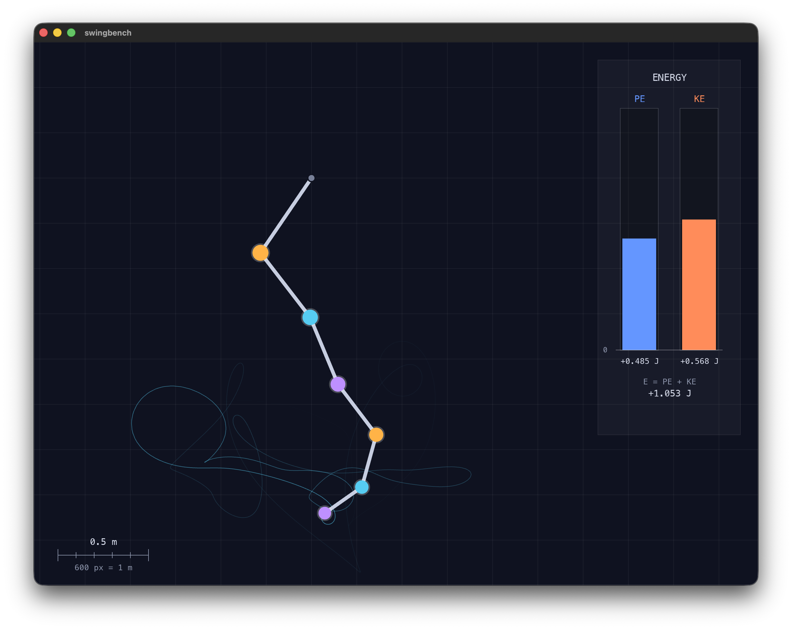

# Swingbench

An n-arm pendulum simulator written from scratch in C++, with a little SFML
window so you can watch it swing.

This is a learning project. I'm using it to work through Lagrangian mechanics
properly (deriving the equations of motion by hand — see the write-ups in
[`math/`](math/)) and, over time,
to practise performance-oriented numerical C++: integrators, floating-point
behaviour, dense linear algebra, SIMD, threading, benchmarking. The simulator
is mostly an excuse to have a concrete problem to do all of that on.



## The maths

Hand-derived equations of motion, worked out step by step in `math/`:

- [2 arms](math/euler_lagrange_derivation_2_arms.pdf) — the double pendulum,
  where it all started
- [3 arms](math/euler_lagrange_derivation_3_arms.pdf) — same approach, one
  more arm, and the pattern starts to show
- [n arms](math/euler_lagrange_generalisation.pdf) — the generalisation: mass
  matrix form for arbitrary n

The `.tex` sources sit next to the PDFs; rebuild with `math/build.sh`.

## What it does right now

- Simulates an n-arm pendulum (absolute angles as generalized coordinates),
  starting from random initial angles.
- Each step builds the mass matrix and solves for the angular accelerations
  with Gaussian elimination (partial pivoting).
- Integrates the equations of motion with classic RK4. There was an explicit
  Euler version first; the energy drift was bad enough to justify the upgrade.
- Renders with SFML: the arms, a fading trail on the tip, a background grid,
  a scale ruler, and live potential/kinetic energy gauges.

Energy conservation is the correctness check for the whole thing — if total
energy wanders, something is wrong with the maths or the integrator, so it's
drawn on screen at all times.

## Building

Needs CMake ≥ 3.28 and a C++20 compiler. SFML 3.1 is fetched and built
automatically via `FetchContent`, so the first configure takes a while.
On macOS the fetch also applies a small patch to SFML so retina displays get
full-resolution (sharp) rendering — see `cmake/patch_sfml_highdpi.cmake`.

On Linux, SFML builds from source too but needs the X11/OpenGL dev packages
first; on Debian/Ubuntu something like:

```sh
sudo apt install libx11-dev libxrandr-dev libxcursor-dev libxi-dev \
                 libudev-dev libgl1-mesa-dev libfreetype-dev
```

```sh
cmake -B build
cmake --build build
./build/bin/swingbench
```

## Layout

```
include/pendulum.hpp   pendulum state + physics interface
src/pendulum.cpp       equations of motion, RK4 step, energy
src/renderer.cpp       all the SFML drawing
src/main.cpp           window + main loop
math/                  the derivations (LaTeX + PDFs)
```

The physics lives in its own little library (`pendulum`) with no rendering
dependencies, so it can be tested and benchmarked on its own later.
